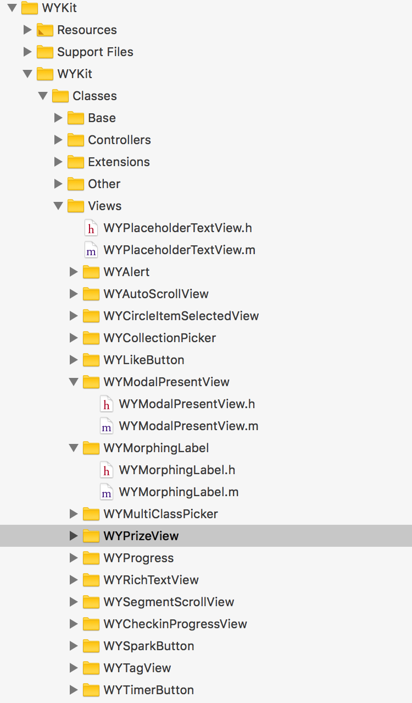
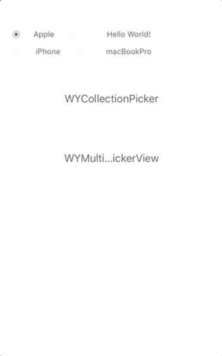
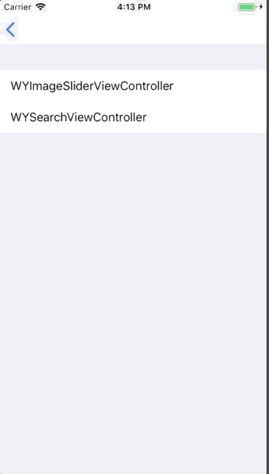

# WYKit

[](http://cocoapods.org/pods/WYChart)
[](http://cocoapods.org/pods/WYChart)
[](http://cocoapods.org/pods/WYChart)
[](http://cocoapods.org/pods/WYChart)

Collection of personal code from daily development，contains some useful custom component, inculde views, viewControllers, categories and so on.

If you love WYChart , encourage me with a star 🌟 , thanks!
如果你喜欢WYKit，给一个星星 🌟 鼓励一下，谢谢！

## Requirements

WYKit works on iOS7+, compatible with ARC.
Some Framework are required, as follow:  

- **Foundation.framework**
- **UIKit.framework**
- **QuartzCore.framework**
- **CoreGraphic.framework**

The frameworks above always included in most xcode project.

## Getting Started
### Installation

WYKit is available through [CocoaPods](http://cocoapods.org). To install
it, simply add the following line to your Podfile:

```ruby
pod "WYKit"
```

#### Cocoapods

To install WYKit in you project, just add the following line to you `podfile`:

<pre><code>pod 'WYKit'</code></pre>

then run following line in terminal:
<pre><code>pod install</code></pre>

#### Add floder
Just dragging the WYKit floder in your download project into you own project.

### Setup

WYKit design the interface like most Controls in UIKit.framework, and contains varies kind of views/controllers/categories, to use one of them you need to import header file, for example: `#import "WYPrizeView.h"`, and realize the required method of protocols.

<p align="center"></p> 
<p align="center">
<b>WYKit Catalog</b>
</p>
</br>
</p>

### Example

* **Views**

<p align="center"></p> 
<p align="center">
<b>WYAutoPlayScrollView</b>
</p>

<p align="center"></p> 
<p align="center">
<b>WYCollectionPicker</b>
</p>

<p align="center"></p> 
<p align="center">
<b>WYCircleProgressBar</b>
</p>

<p align="center"></p> 
<p align="center">
<b>WYTimerButton</b>
</p>

<p align="center"></p> 
<p align="center">
<b>WYCheckinProgressView</b>
</p>

<p align="center"></p> 
<p align="center">
<b>WYLikeButton</b>
</p>

<p align="center"></p> 
<p align="center">
<b>WYSparkButton</b>
</p>

<p align="center"></p> 
<p align="center">
<b>WYMorphingLabel</b>
</p>

* **Categories**

<p align="center"></p> 
<p align="center">
<b>UIView+WYBadge / UIView+WYCurryAnimation</b>
</p>

<p align="center"></p> 
<p align="center">
<b>UIButton+WYIndicator</b>
</p>

* **Controllers**

<p align="center"></p> 
<p align="center">
<b>WYImageSliderViewController</b>
</p>

<p align="center"></p> 
<p align="center">
<b>WYSearchViewController</b>
</p>

## License

WYKit is available under the MIT license. See the LICENSE file for more info.

## Features

### v0.1.0

Initial release.

## Contact

If you have any problem or got an idear, i will be glad if share them to me by a `#issue` or [georgewang003@gmail.com](georgewang003@gmail.com), and this my [personal blog](http://blog.oneinbest.com) where you can find some technology about WYKit or any other topics.
